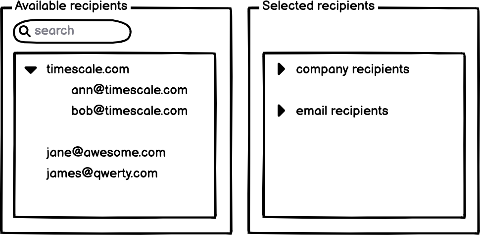

# Timescale Frontend Programming Assignment

Thank you for taking the time to apply for a frontend position at Timescale!
We hope you'll enjoy this small coding assignment that was designed to illustrate your coding skills. It should take around
3 hours to complete at a time of your choosing. If you have any questions, feel free to reach out to us and we'll be happy
to help. Happy hacking!

## Assignment

Implement a React component that allows managing email addresses. The component displays two lists: available recipients and selected recipients.

Use the included `recipientsData.json` file to populate the lists within the component.

### Use cases

As a user, I can
- See the list of all available recipients. A recipient is either an email or a group of emails sharing the same company domain
- Select an individual recipient or a company domain. When a company domain is selected, all emails with the domain are added to the selected recipients' list
- Enter the name of a company into the autocomplete and select a recipient from the available suggestions
- Enter any email in the autocomplete. If the email passes validation it is possible to add it to the list of available recipients
- See the list of the selected recipients that are grouped into company and email recipients. The groups are expandable and show the contained members
- Remove the recipients from the selected list. It is possible to remove an individual email or all emails sharing a domain at once

### The rules

- The component should have a simple and clean design
- You can use a component library of your choice (we use Chakra UI) 
- The component should work in the latest Chrome on Mac OS
- We don't expect a full test coverage, but a couple of unit tests would be nice to have
- Fork the repo to your own account, make it public and send us the repo url when you are completed. We will
  clone and run the site on our local.

### Solution

1. I have create 3 different components:
  - `EmailManager`: The main component that displays the two lists and handles the user interactions and state management, also renders the `RecipientList`components.
  - `RecipientList`: a component that displays a list of recipients.
  - `RecipientItem`: a component that displays a single recipient.
2. In the begining the EmailManager was hanling all states and logics, but it start to get bigger and complex, with a lot of state and logic. then I decided to split the logic into a custom hook called `useRecipients`. The hook is responsible for managing the state of the component and the logic of filtering and grouping the available and selected recipients.
3. I have created a very simple custom hook called `useDebounce` that is responsible for debouncing the search input preventing the user from typing too fast and making a lot of requests to the server (Not in that scenarios as we are using a static data (JSON FILE), but it is a good practice to use it in any case).

I used just Chakra UI for the design, lucide-react for the icons and react testing library for the unit tests.

For tests I used @testing-library/react to test some components and behaviors, like the RecipientItem component, actionClicks, icons and in the EmailManager component I tested the Input filter

I have applied some performance optimizations, like using `useMemo` and `useCallback` to avoid unnecessary re-renders. and also React.memo for the components.

As it's a simple component and I dont want to use more than the time recommended, I haven't used Redux or Context API, but I think it would be a good if the component get more complex and use more state management.

Other possible improvements is to Improve the useRecipients hook, maybe using a useReducer hook to manage the state as theres a bunch of functions handling the states, maybe componentize some other components like the Input, if we need to reuse it in other places.

I would love to hear any kind feedback or suggestions, and I hope you like my assignment.
Thanks for the opportunity

### Socials
[GitHub](https://github.com/ArthurJFreitas) | [LinkedIn](https://www.linkedin.com/in/arthurfscode/)
 